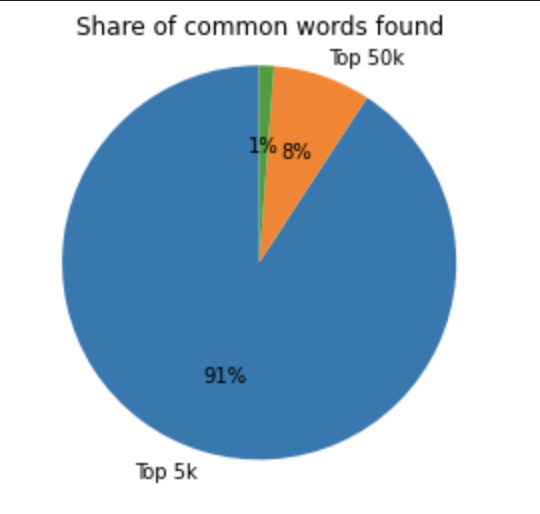

# English Language Learning Vocabulary Scoring
This post is an outline and description of the code seen in our respository. Our code is distributed between three files: "english-language-learning.ipynb" contains all the TF-IDF and Neural Network code, "OOV.ipynb" contains the Out of Vocabulary word detection code, and "visualization.ipynb" contains code for some of the graphs created. The data folder contains the data used in this project, images folder contains images of graphs and code, and lastly the models folder contains some of the trained models that we saved for future use. 

## Overview
1. Introduction
2. Results of Initial Approach and Analysis 
3. The Secondary Approach
4. Identification of “Out of Vocabulary Words”
5. Results and Future Directions 


## 1. Introduction

Every year, many English Language Learners (ELLs) are assessed on their language skills and writing level. These frequently come in the form of standardized tests and are assessed by workers who see hundreds of essays every day. That work is tiresome, difficult, and often very subjective, as readers are forced to put numbers on typically qualitative data, such as the strength of a student’s grammar, writing comprehension, or vocabulary. When we stumbled upon a Kaggle Competition about measuring features of ELLs’ essays, we knew this would be a great area to investigate. 

Additionally, the fact that this data set revolved around assessing students in which English was a secondary language appealed to us. We all have had sufficient experience with learning new languages, such as Spanish and Danish, and understand the difficulty of learning and then writing in a new language. We also acknowledge that learning a language comes with a plethora of struggles, such as an accidental substitution of words from a more familiar language, misspelling of words that the students comprehend, and grammatical errors. The dataset we found contained a collection of essays and graded results on six features of essays, but we decided to focus on creating a model to predict specifically the vocabulary score for an essay. 

We picked to measure the vocabulary of ELLs because it is a complex underlying structure of every essay, blog post, or news article. A successful model that could measure the vocabulary strength of a piece of text would provide crucial information about the strength of any writer that you are reading. It also comes with an array of challenges that we wanted to tackle. For starters, how would you measure the strength of the vocabulary of this blog post thus far? Personally, we would measure it as average, but the writing itself is correctly performing the function it is intended to do, which is to introduce our project. Since these essays are written by language learners, we need to consider that these prompts are likely not complex prompts that require a large amount of writing and advanced terminology. Additionally, a challenge with specific language learners is addressing misspelled words or words of a different language, since they would be more common than in a typical post. Measuring the vocabulary of these students’ writing is a meaningful and important task, and we will explain in the upcoming sections how we approached this problem and the results of our work.

## 2. The Initial Approach 

When we first approached this problem, we knew the primary challenge would be selecting an appropriate approach. Many Natural Language Processing (NLP) solutions use Recurrent Neural Networks (RNNs) to process text in a sequential manner. Generally, vocabulary is not dependent on the sequence of words, but rather the types of words that are used. For ELLs writing, we expect that use of common words suggests a low level of grammar, while use of less common words suggests the opposite. Therefore, we looked for a method of classifying the complexity of the words used in each essay.

To accomplish this, we turned to the TF-IDF method. TF-IDF stands for term frequency inverse document frequency, and it measures how frequently a word is used in a document relative to its use in all documents in a pool. In our first approach, we used SKLearn’s built in TF-IDF vectorizer, which uses the following formula to create a score for each word in collection of documents:
- TF is calculated by # of times a word appears in current document
- IDF is calculated by log base e ([1 + # documents] / [1 + # documents word appears in])
- SCORE = TF * IDF

The result of this formula is that words with high frequency in the current document and low frequency overall have the highest scores, and words with low frequency in the current document and high frequency overall will have the lowest scores. Note that the score is zero for any word that does not appear in the current document. For each document, the TF-IDF vectorization produces a single vector with length equal to the total number of unique words in all documents. The vectorizer then normalizes the TF-IDF vector so that it can be compared with other vectors better. Our idea was to then use these TF-IDF vectors as the input to our neural network.

We selected this approach because we believed higher vocabulary scores would be given to writing with words that are not used as frequently. To test this theory, we used the TF-IDF vectorization of the training data, then trained a neural network with the vectorizations and the given vocabulary scores for each essay. With the data from Kaggle, we had 3,911 total essays. We did a 80/20 training/testing split on the data, so we had 3,128 essays for training and 783 essays for testing. 

Our model was as follows:
```
model = Sequential([
    Dense(2000, activation='relu'),
    Dropout(0.5),
    Dense(1000, activation='relu'),
    Dropout(0.5),
    Dense(500, activation='relu'),
    Dropout(0.5),
    Dense(100, activation='relu'),
    Dense(1, activation='relu')
])

model.compile(optimizer='adam',
                loss='mse',
                metrics=['mean_absolute_error'])
```

The mean-squared-error (MSE) training loss was 0.0298. However, we needed to test the network on the testing data to get an accurate representation of its success.

We needed to create TF-IDF vectors for the testing data before we could feed it into the network. We can’t run the same SKLearn function for this, though, because TF-IDF scores depend on analyzing a collection of documents. In theory, our model needs to work for a single new input essay, so we need to reuse some information from the TF-IDF vectorization of the training data. To be precise, we use the IDF vector created in this process that indicates the frequency of each term in the training data. We then count the frequency of each of those terms in the testing data. The drawback of this approach is that any new terms in the testing data will be ignored in our process. However, there were 18,913 unique terms in the training data, so the model will still get a sizable amount of information from the testing data. Once we had term frequency (TF), we multiplied the TF vector by the precomputed IDF vector, then normalized the result. This process created full TF-IDF vectorizations for the testing data.

Once the TF-IDF vectors were computed for the testing data, we evaluated the model. The MSE loss for the testing data was 0.2839. Clearly, this is much higher than the MSE of 0.0298 which was the loss in training, so overfitting was a concern of ours. However, this result confirmed that the TF-IDF approach was viable. At this point, we then began thinking about other improvements that could be made. We didn’t want the TF-IDF vectorization to depend on a narrow selection of ELLs’ essays, so we looked for a different approach.

## 3. The Secondary Approach
	
We began to question the ways in which this model could be improved. In particular, we analyzed our primary method of categorizing every essay and the TF-IDF metric itself. TF-IDF is typically used to assess the importance of a word to a document in a corpus. In our case, we used this metric to analyze each essay in which the corpus was the entire collection of essays. However, after creating the first approach, we noticed two drawbacks with this approach. The first drawback is that the word pool was restricted to only words that were in the corpus of essays. As mentioned earlier, this would mean any new terms that were not in the training set would then be discarded in order to create the new custom TF-IDF vector to send into the network. This leads to issues, as there are some words that ELLs might not know, and could be used. Since we are aiming to measure total vocabulary skill, we need to successfully account for the use of words that aren’t typically used, such as ones that might get discarded in this first approach. 

The second drawback that we identified is that the word understanding of ELLs is likely different from the word understanding of the graders, which we are training our network to imitate. Since we are using the TF-IDF to measure the use of words that are unique to a specific essay and not for the usually intended purpose of measuring the importance to a document, we thought of a new approach that could hopefully classify words as more common or less common through the use of the most commonly used English words, by all people, and not just ELLs. 

For this new approach, we looked at a Kaggle dataset labeled “English Word Frequency” that contained the most common ⅓ million words in English on the web. For every word, it lists the frequency of the word as well. From this, we developed a new idea: creating a custom TF-IDF metric that took into consideration the number of times a word was used in a document and the frequency of the word in the English language. In order to find the new “inverse frequency” statistic, we built it similar to the way SKlearn computes the inverse document frequency over a corpus of documents. As a reminder, SKlearn computes IDF as:

IDF is calculated by log base e ([1 + # documents] / [1 + # documents word appears in])
To make a similar metric, in our approach, we take the highest frequency of a word, which is “the” with a frequency of 23,135,851,162 and use that as the numerator, and use the frequency of the word we are identifying as the denominator. We then take the log base e of this ratio. To test the plausibility of this approach, we look at two words: “from” and “ethnicity.” “From” is the 21st most occurring word with a frequency of 2,275,595,356 while “ethnicity” is the 10000th with a frequency of 5,055,334. The IDF scores for the two would be as follows:

- “from”: log base e [(1 + 23135851162)/(1 + 2275595356)] = 2.32
- “ethnicity”:  log base e [(1 + 23135851162)/(1 + 5055334)] = 8.43

Looking further, the data set we collected contains more than 333,000 words. Knowing that it would be very difficult to encode and pass around vectors of that size, we wanted to calculate which threshold of words to store in the vector. Here is a graph displaying the data:



As seen in the pie chart above, the majority of the words used by ELLs are in the 5,000 most frequent English words. If we take into consideration the top 50,000 words, we cover almost every word the ELLs use. Thus, we chose that as the size of our word pool. Since we could not use the SKlearn method, we needed to create code to take the words out of every essay. To do this, we had to clean each essay which consisted of:
- Removing all punctuation
- Converting all text to lowercase
- Splitting on whitespace into an array of words

Once we had the word pool for every essay, we iterated through and calculated the term frequency for each of the top 50,000 words. This step left us with two vectors, a TF vector of size 50,000 and the previously created IDF vector of size 50,000. To create the TF-IDF vector, we simply multiplied the two together and then normalized each sub-array. We then broke our data up into training and testing data sets with an 80/20 split. Since we wanted to compare this model to the previous model, we decided to use the same model structure as the previous step.

After creating the model, the mean squared error for the training step was 0.2212. When we evaluated the model with the testing data set, we were scored with an MSE loss of 0.8631. To our dismay, this model did not perform as well as expected, since we had hypothesized it to be an improvement over the previous model. We believe a large attributor to this was that the model structure used to create this network was the same as the previous step. We believe that if we had created a larger network with either more hidden layers or a larger first layer, we would have been better able to account for the size of the input vector to the neural network. Yet, we still had other strategies that we wanted to try out.

## 4. Identification and replacement of “Out-of-Vocabulary Words”
	
Another step we took to improve our initial model was how to deal with “out-of-vocabulary” words, or OOVs. We have developed all of the code that is mentioned below, but because of recent repetitive kernel failures, we have been unable to fully implement OOV detection and replacement with our other approaches. However, we aim to fully incorporate dealing with OOVs in the very near future. An OOV is defined as a word which is not present in a training dataset or recognized by an NLP library. In our case, we used the spaCy NLP library to process OOVs. OOVs can pose as a big problem in any NLP model as they are not “natural language”, and may be mishandled by an NLP model. In the case of our problem at hand, an OOV would alter our models’ predicted score of vocabulary in a detrimental manner. The reason being is that an OOV would have a high-valued TF-IDF representation, or score, for it would appear very rarely throughout the corpus of our essays. 

For instance, let us say a student wrote the word “interesante” in an essay. This word would be labeled as an OOV, for it is not an English word. Because this is not an English word, the frequency with which “interesante” shows up in an English essay would be very low, resulting in a high TF-IDF score. This high TF-IDF score would result in increasing the vocabulary score for this student's vocabulary, in effect, rewarding the student for using incorrect English vocabulary. This would lead to inflating the vocabulary score for students who use incorrect English vocabulary or use non-English words. 

At first, one would think, “simply remove the OOVs”. Though this sounds like a simple fix, this would actually degrade our vocabulary predictions. This is because a misspelled word also gets flagged for being an OOV; however, we do not want to remove misspelled words because more difficult words, such as “abhorrent”, are more likely to be misspelled than common words such as “the”. If we remove a misspelled “abhorrent”, then we would not be recognizing a student’s advanced vocabulary, thus we cannot remove any OOVs out of this fear. One might then say, simply “auto-correct” the English word like an iPhone. However, this would not work in our case either, for misspelled words are not the only “word” to be flagged as an OOV. In addition to misspelled words, words in other languages such as Spanish would also be flagged as OOVs as well as words that do not resemble any language (e.g. nonsense).

In order to account for all of these cases (and more) which might yield an OOV, we decided it would be best to replace the OOV with a word that has similar semantics. For example, the word “u” might be replaced with “you”, the word “bueno” might be replaced with the word “good”, and the word “rejkhaivk” in “I like to eat rejkhaivk” might be replaced with “food”. How do we do this? First we need to be able predict a word’s semantics, specifically, an OOV word’s semantics. In order to do this, we first trained two LSTM models on a dataset which included IMDB reviews, offering examples of common English words that an english learner might use. The structure of the forward model can be seen below (Mustafa Abdel Ibrahim: https://github.com/7MustafaAdelIbrahim/Handling-Out-of-Vocabulary-Words-in-NLP-using-a-Language-Modelling): 
```
model = Sequential()
model.add(Embedding(vocab_size,100, input_length=max_length-1))
#model.add(LSTM(100))
model.add(Bidirectional(LSTM(100)))
model.add(Dense(vocab_size, activation='softmax'))
print(model.summary())

```
```
Model: "sequential_18"
_________________________________________________________________
 Layer (type)                Output Shape              Param #   
=================================================================
 embedding_18 (Embedding)    (None, 57, 100)           73600     
                                                                 
 bidirectional_18 (Bidirecti  (None, 200)              160800    
 onal)                                                           
                                                                 
 dense_17 (Dense)            (None, 736)               147936    
                                                                 
=================================================================
Total params: 382,336
Trainable params: 382,336
Non-trainable params: 0
_________________________________________________________________
None

```

Given an OOV in a corpus, these models were trained to predict what word the OOV is “meant to be”. One LSTM model analyzes text before the OOV (forward model) and the other LSTM model analyzes text after the OOV (reverse model), and both models return a list of words it believes should replace the OOV. This can be seen in the code snippet below: 

```
doc=nlp("You are not cool. You destroy cawul objects.")
doc=set_embedding_for_oov(doc)
doc
```
```
Words predicted from forward sequence model:
adverse
know
Words predicted from reverse sequence model:
raise
film
brand
green
```


Each of these predicted words form the forward model and reverse model have a vector representation, or word embedding, provided by the spaCy library. We then iterate through both of these lists, take each word embedding, apply a logarithmic function to the embedding, and sum the results across both lists. The OOV then gets assigned this summed value as its word embedding. Doing this essentially aims to capture where this OOV belongs in the vector space based off of where the predicted words exist in the vector space, which are in turn influenced by the context of the corpus before and after the OOV as analyzed by the forward and reverse models. Now that we have a vector for the OOV, we then use a spaCy function which finds the closest vector in the vector space to the OOV’s vector. We then take this closest vector, retrieve the word it represents, and we then swap the OOV with it. Because these two vectors were closest to each other in the vector space, they will also be the closest in semantics (for this is the whole point of spaCy word embeddings), therefore maintaining the semantics of the essay.

```

doc=nlp("u are not cool. You destoryh precious things.")

doc=set_embedding_for_oov(doc)

doc

```
```
'you are not cool. You break precious things.'
```

Doing this still presents some issues. Because the OOV now has a vector representation, if the same OOV appears again, it will not be replaced. Furthermore, in theory, the OOV could be used to replace another OOV. To counteract this, we then reset the spaCy word embeddings to their original values, which discards the OOV’s embedding. Thus, the OOV now cannot be used to replace other OOVs, and the OOV will be replaced each time it appears. With these measures in place, any essay which is sent to our function, will have misspelled words, non-English words, and nonsense words all replaced with actual English words which preserve the semantics of the essay. This results in all essays having a clean format which can be used to accurately calculate TF-IDF scores for all words used, resulting in accurate scoring of a student’s vocabulary. 


## 5. Conclusions and Future Directions

The work done on this project demonstrates the complexity of NLP, especially with the edge case of writing by non-native English speakers. We outlined multiple approaches in this blog post, but there are many others that we’d like to explore. First, we want to merge the work replacing the “out-of-vocabulary” words with the initial approaches to look for an improvement in the accuracy of the models. This related to another obstacle to the improvement of accuracy, which was the limited resources available. We are interested in the effects of training larger networks to approach this problem because we were limited by the speed of our hardware in the training phase. Finally, there is the possibility of training these models on a different dataset. It would be interesting to see how these approaches perform with essays written by native English speakers, especially young students. When we created this project, a large struggle was the lack of research on this topic, especially using the technique we utilized. However, this is promising to us, as we are getting into a cutting-edge field of study at the right time and look forward to improving on this first approach to measuring the vocabulary of ELLs.
